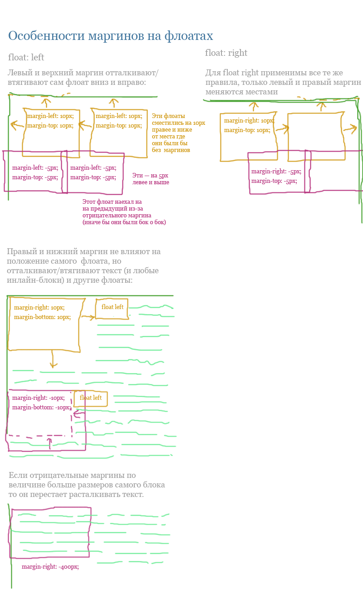

# Особенности свойства margin на элементах с float

На плавающих элементах (с `float: left/right`) можно задавать маргины с 4 сторон, в том числе отрицательные. Некоторые маргины сдвигают сам плавающий элемент, а некоторые - отталкивают или втягивают окружающий его текст и инлайновые элементы. На картинке я попытался это отобразить.

Для элементов `float: left`: левый маргин сдвигает флоат вправо-влево, правый — влияет на окружающий текст и элементы.

Для элементов с `float: right`: левый маргин сдвигает окружающие элементы, а правый — сам плавающий элеимент.

Верхний маргин всегда сдвигает сам флоат, а нижний - окружающие элементы.

