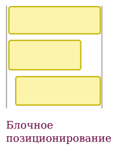
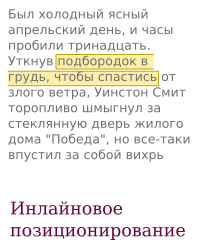
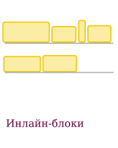
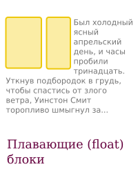
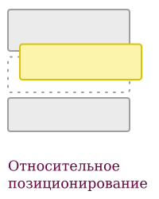
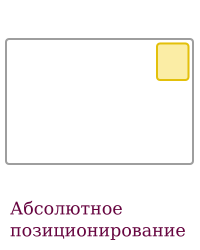
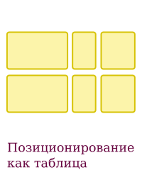
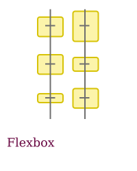
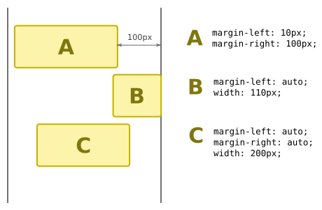

# Способы позиционирования элементов в CSS 

В CSS есть разные способы *позиционировать* или располагать элементы относительно друг друга. Можно указать, что элементы должны выстраиваться горизонтально, или вертикально, друг над другом, или еще как-то. Ниже мы разберем все доступные варианты. 

Способ позиционирования элементов задается с помощью CSS-свойств `display` (по умолчанию имеет значение `block` или `inline` в зависимости от того, блочный это элемент или строчный), `float` (имеет значение `none`) и `position` (имеет по умолчанию значение `static`). 

## Боксовая модель

Бокс - это воображаемый прямоугольник на странице, который соответствует HTML-элементу (вроде `h1` или `p`). Боксовая модель описывает, как определяются размеры этого прямоугольника и его частей, что такое border, padding и margin.

Прежде чем браться за позиционирование, необходимо выучить свойства `width`, `min-width`, `max-width`, `height`, `min-height`, `max-height`, `padding`, `background`, `border`, `margin`. Прочитать про них можно здесь: 

- http://softwaremaniacs.org/blog/2005/07/07/css-boxes/ (то, что написано про IE6, уже не актуально и можно не читать)
- http://htmlbook.ru/samlayout/blochnaya-verstka/blochnaya-model
- http://xiper.net/learn/css/box-model/what-is-the-box-model
- https://developer.mozilla.org/ru/docs/Web/CSS/box_model
- https://developer.mozilla.org/ru/docs/Web/CSS/box-sizing

Также, необходимо прочитать про единицы измерения в CSS (в первую очередь - `px` и `%`): 

- http://htmlbook.ru/content/edinitsy-izmereniya

Стоит помнить, что в некоторых случаях указание размера в процентах не работает. Например, для свойства `height` задавать значение в процентах можно только если для всех элементов, в которые он вложен (предков), задано значение `height`.

### Значения по умолчанию

Если высота элемента не задана явно (или указано `height: auto`), то она определяется содержимым элемента. Если ширина не указана явно, то способ ее определения зависит от способа позиционирования. Свойства `margin` и `padding` имеют значение `0` по умолчанию, однако для некоторых элементов в браузере заданы ненулевые значения по умолчанию. Например, заголовки `<h1>` и абазцы `
` имеют ненулевые `margin-top` и `margin-bottom`, чтобы между ними были отступы.

### Замещаемые элементы

*Замещаемые* (replaced) элементы - это элементы, которые имеют внутренние размеры, например, картинки (``), кнопки (`<button>`), поля ввода (`<input>`) и другие элементы форм. Они ведут себя не так, как обычные элементы: 

- для них `display: inline` работает как `display: inline-block`
- если для них ширина или высота не задана явно (`width: auto`), то она определяется их содержимым независимо от используемого способа позиционирования. Например, если поставить картинке свойство `display: block`, то она не растянется на всю ширину родителя.

## Виды позиционирования

Вот список способов позиционирования. Ниже мы подробно разберем каждый из них.

## Блочное 

Блочное позиционирование включается заданием свойства `display: block` при отстутствии `float` и `position`. Элементы с таким позиционированием выстраиваются вертикально друг над другом. Последовательность таких элементов еще называется *поток* (flow).

Многие элементы имеют значение `display: block` по умоланию, например, заголовки `<h1>`-`<h6>`, абзацы `
`, списки `<ul>`, `<li>`. Поэтому их называют *блочные* элементы.

Вот главные особенности этого способа позиционирования: 

- элементы выстраиваются вертикально друг над другом. Промежутки между ними можно регулировать с помощью вертикальных отступов (`margin-top`, `margin-bottom`)
- ширина элементов, если она не задана, подбирается так, чтобы занять всю ширину родительского элемента (с учетом свойств `margin`, `padding`, 'border')
- вертикальные отступы (`margin-top` и `margin-bottom`) соседних элементов накладываются друг на друга, это называется margin collapsing (схлопывание отступов).

Внутренняя ширина элемента (`width`), а также правый и левый отступы (`margin`) подбираются так, чтобы элемент занимал всю доступную ширину. Если задать значения только одному или двум из них, оставшиеся значения будут вычислены автоматически. Рисунок ниже показывает, как можно использовать комбинации этих свойств, чтобы прижать элемент к краю или выровнять по центру.

Для блока A заданы отступы справа и слева, потому ширина подбирается так, чтобы занять все пространоство между ними. Для блока B ширина отступа слева указана как `auto`, отступ справа имеет значение по умолчанию 0, и задана ширина, потому блок оказался прижат к правому краю. Наконец, для блока C задана ширина и оба отступа равны `auto`, потому он центрируется.

Замещаемые элементы (картинки, кнопки, элементы форм) не растягиваются на всю ширину родителя, их ширина определяется другими способами.

Более подробно про блочное позиционирование (и про margin collapsing) можно почитать тут: 

- http://softwaremaniacs.org/blog/2005/08/27/css-layout-flow/

## inline-позиционирование

Инлайн-позиционирование применяется для задания стиля (шрифт, цвет) или выделения фрагмента текста. Оно включается свойством `display: inline`. Строчные элементы вроде `<a>`, `<em>`, `` имеют это значение по умолчанию.

Инлайн-элементы не имеют собственных размеров, а располагаются вокруг текста и содержимого, которое находится в них. По этой причине для них не работают свойства `width`, `height`, `margin-top`, `margin-bottom`. При этом свойства `margin-left` и `margin-right` работают и позволяют добавить отступ слева или справа. 

Поскольку текст может переноситься на несколько строк, инлайн-элементы переносятся вслед за ним и могут состоять из нескольких отдельных прямоугольников. Свойства `padding-top`, `padding-bottom` у инлайн-элементов влияют только на размеры фона, но не влияют на высоту строки текста.

Иллюстрация ниже показывает пример инлайн-элементов. На ней видно, как отображается border элемента, когда он располагается на нескольких строках: 

Инлайн-элементы можно выравнивать по вертикали относительно друг друга и соседнего с ними текста с помощью свойства `vertical-align`.

С помощью свойства `border` инлайн-элементом можно реализовать цветное подчеркивание и надчеркивание текста.

Для замещаемых элементов (вроде картинок) `display: inline` работает как `display: inline-block`. Например, для них можно задавать ширину и высоту, в отличие от обычных инлайн-элементов.

## inline-block

Инлайн-блоки ведут себя как слова в тексте: они выстраиваются друг за другом слева направо, переносятся на новую строку, если на текущей строке не хватает места, подчиняются заданным на их родителе свойствам вроде `text-align`, `line-height`. Такой способ позиционирования включается указанием свойства `display: inline-block`.

Для инлайн-блоков можно задавать ширину и высоту, если ширина не задана, то она определяется из размеров содержимого и ширины родителя с помощью [алгоритма shrink-to-fit, описанного в отдельном уроке](./shrink-to-fit.md). 

Инлайн-блоки можно выравнивать по вертикали относительно друг друга и соседнего с ними текста спомощью свойства `vertical-align`. Горизонтальное выравнивание задается на родителе свойством `text-align`, а правила переноса на новую строку с помощью `word-wrap`. Обратите внимание, что свойства `text-align` и `word-wrap` задаются не на самом инлайн-блоке, а на ближайшем родителе со свойством `display: block`.

## Плавающие элеименты (float)

## Различия между float и inline-block элементами

## Относительное позиционирование

## Абсолютное позиционирование

## Табличное позиционирование

## Flex

## Спецификации и ссылки

- Уроки по CSS https://html5book.ru/osnovy-css/
- Довольно старый перевод спецификации CSS2 http://www.codenet.ru/webmast/css2/cover.php

